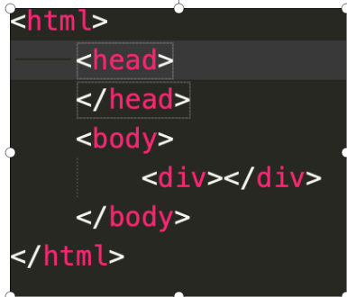
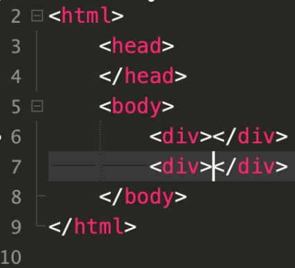
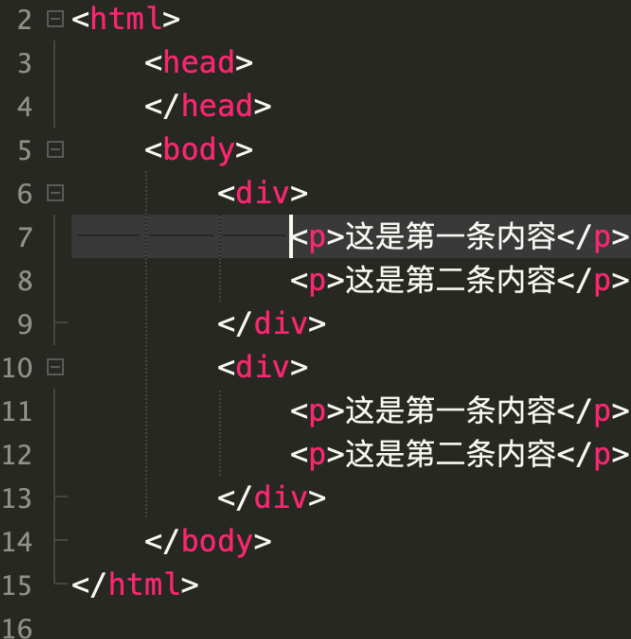

### 创建HTML文件

文件后缀名必须为`html`或者`htm`


### HTML基本结构及基本标签

#### HTML的基本组成部分

<HTML>	<head>	<body>

##### 基本结构如下：

```
<html>                  				//用来标记HTML文档的开始，告诉浏览器，网页的代码用什么格式来解析
    <head>                               //用来标记HTML文档头部的开始
        <meta charset="UTF-8">           //告诉浏览器网页的汉字用什么字符集，使用的字符集不正确，就会出现乱码 
        <title>Document</title>          //给页面起个名称，便于搜索引擎的搜索
    </head>                         //用来标记HTML文档头部的结束
<body>                          //用来标记HTML文档主体的开始
    
    网站的内容，99%的内容都放入body标签中，只有放入该标签，才能在窗口显示（网页内容放入body中）

</body>                         //用来标记HTML文档主体的结束      
</html>                         //用来标记HTML文档的结束
```

###### **演示：**

​	记事本示范练习，创建第一个html文件。

###### **随堂练习**：

​	创建自己第一个HTML文件。

###### 注意点：

​	文件后缀名必须为html或者htm，注意结构。


### HTML标签简介

#### 标签分类

​	指使用尖括号括起来的关键字，通常将HTML标签分为两大类，分别是“**双标签**”、“**单标签**”

###### 双标签： 

​	标签成对出现，语法：<标签名>内容</标签名>

​	`例子`

```
<div>内容</div>
<p>内容</p>
<h1>这是一个标题</h1>
<h2>这是一个标题</h2>
<h3>这是一个标题</h3>
```


###### 单标签

​	标签单独出现，语法：<标签名 / >，单标签后面要闭合，标签外无内容。

`例子`

```

<br/>
<hr/>
```


#### 标签属性

使用HTML制作网页时，如果想让HTML标签提供更多的信息，例如：希望标题文本居中显示，段落文本。

HTML标签设置属性的基本语法格式：

```
<标签名 属性名1="属性值1" 属性名2="属性值2" …>内容</标签名>
```

```html
<p align="center">我是居中显示的文本</p>
```


#### 注释语句

```
<!-- 注释语句 -->
```


#### 小写标签名

HTML标签可以使用大小写英文字母

​	1、不建议大写或者大小混合写标签。

​	2、开发人员通常使用小写。

​	3、小写风格可以使代码看起来更加干净，整洁。

​	4、小写字母更加容易书写

###### 不推荐

```
<SECTION>
 <p>这是一个段落。</p>
</SECTION>


<Section>
 <p>这是一个段落。</p>
</SECTION>
```

###### 推荐

```
<section>
  <p>这是一个段落。</p>
</section>
```


#### 关闭所有的HTML元素

###### 不推荐

```html
<section>
 <p>这是一个段落。
 <p>这是一个段落。
</section>
```

###### 推荐

```HTML
<section>
  <p>这是一个段落。</p>
  <p>这是一个段落。</p>
</section>
```


### HTML基本标签

------


#### 文本控制标签

为了使网页更具有语义化，（语义化是指赋予普通网页文本特殊的含义），我们经常会在页面中用到标题标签，HTML提供了6个等级的标题，即`<h1>`、`<h2>`、`<h3>`、`<h4>`、`<h5>`和`<h6>`，从`<h1>`到`<h6>`标题的重要性依次递减。标题标签的基本语法格式如下。

`演示`

```html
<h1 align="center">一级标签</h1>
<h2 align="right">二级标签</h2>
<h3 align="left">三级标签</h3>
<h4>四级标签</h4>
<h5>五级标签</h5>
<h6>六级标签</h6>
```

1~6级为标题，align为可选属性，用于指定标题的对齐方式，align取值如下：

`left`：设置标题文字左对齐（默认值）

`center`：标题文字居中对齐

`right`：标题文字右对齐


注意：

1、一个页面中只能使用一个`<h1>`标签，常常被用在网站的logo部分。

2、由于h标签拥有特殊的语义，请慎重选择恰当的标签来构建文档结构。

3、HTML中一般不建议使用h标签的align对齐属性，可使用CSS样式设置。


`练习`

​	h1到h6标签各使用一遍。

------


#### `<p>`段落标签

段落是通过 `<p>` 标签定义的。

`演示`

```html
<p>这是段落。</p>
<p>这是段落。</p>
<p>这是段落。</p>
<p>段落元素由 p 标签定义。</p> 
```

`练习`

​	使用p标签创建两行文字

------


#### `<br>`换行标签 

​	开始新的一行

`演示`

```html
<p>这是一条不能换行的内容。<br/>我想让这条内容转到下一条</p>
```

`练习`

​	使用**b**标签和**br**标签，书写一则新闻

------


#### `<hr/>`水平线标签

在网页中常常看到一些水平线将段落与段落之间隔开，使得文档结构清晰，层次分明。水平线可以通过`<hr/>`标签来定义

```html
<hr/>
```


------


#### 文本格式化标签

在网页中，有时需要为文字设置粗体、斜体或下划线等一些特殊显示的文本效果，为此HTML提供了专门的文本格式化标签，使文字以特殊的方式显示。	

| 标签              | 描述                   |
| :---------------- | ---------------------- |
| `<b>`、`<strong>` | 文字以粗体方式显示     |
| `<em>`、`<i>`     | 文字以斜体方式显示     |
| `<s>`、`<del>`    | 文字以加删除线方式显示 |
| `<small>`         | 定义小号字             |
| `<sub>`           | 定义下标字             |
| `<sup>`           | 定义上标字             |
| `<ins>`           | 下划线                 |


------


#### 特殊字符标签

| 特殊字符 | 描述           | 字符代码  |
| :------: | -------------- | --------- |
|          | 空格符         | &nbsp；   |
|    <     | 大于号         | &lt；     |
|    >     | 小于号         | &gt；     |
|    &     | 和号           | &amp；    |
|    ￥    | 人民币         | &yen；    |
|    ©     | 版权           | &copy；   |
|    ±     | 正负号         | &plusmn； |
|    ×     | 乘号           | &times；  |
|    ÷     | 除号           | &divide； |
|    ²     | 平方2（上标2） | &sup2；   |
|    ³     | 立方3（上标3） | &sup3；   |


------


#### div和span标签

div和span是我们开发网页中使用最多的元素之一

##### div	块级元素

`<div></div>`标签是用来当做容器，用来包裹其他HTML标签，将HTML内容分为不同的区块。

本身没有任何特殊意义也不到任何标签语义。

 定义：独占一行，元素的宽高、以及内外边距都可以设置；

##### span	行内元素

`<span></span>`标签是用来包裹文字或其他行内元素的HTML标签，用途是给css做样式排版。

定义：不会自动进行换行，元素的宽高不可设置，元素宽度随着内容发生变化


------


#### ``图像标签

```
 
```

`src`：路径（相对路径和绝对路径）

相对路径和绝对路径

​		一、相对路径：从html文件自身出发，通过层级关系寻找图片位置。

​		二、绝对路径：从电脑根目录，直接访问图片位置。

目录层级关系

​		a) 	./ 所在的目录

​		b) 	../ 上一级目录


`alt`：图片不显示时，浏览器显示的文字

`title`:	鼠标悬浮出现的文字

`width`:	设置图片的宽度

`height`:	设置图片的高度


------


#### `<a>`超链接标签

```
<a href="http://www.baidu.com/"  target="_blank">链接</a>
```

##### `href`：属性，指向另一个网页的链接

`内部链接`：访问同一个目录下的文件夹，加上路径文件名和后缀

```
<a href="03.html">03页面</a>
```

`外部链接`：外部链接跳转到网址一定要加上：http://**；外链需注意格式，http://www.baidu.com/

```
<a href="http://www.baidu.com/">03页面</a>
```

`空链接`：空链接会跳转到页面的顶端，href里面加#即可。

```
<a href="#">我是空连接</a>
```

`锚点链接`：

定义锚点：给a标签加name或者id属性。

​	`<a id="head"><a id="head">`

使用锚点：

​	`<a href="#head"></a>`

```
<a id="head">我是锚点链接，需要找到我</a>
<div style="width: 100px;height: 1000px;border: 1px solid black;"></div>
<a href="#head">我是需要找到锚点链接的a标签</a>
```

##### `target`：属性，打开新页面的方式

`_self`：自我覆盖，默认值

`_blank`：创建新窗口，打开新页面（常用）

##### `title`：属性，鼠标经过悬停于a标签时提示内容


------


#### `<table>`表格标签

定义表格标签

以下为表格table的属性：

`border`：默认表格不显示边框，显示边框属性为border，`border="数值"`

`cellspacing`：表格单元格间距

`cellpadding`：表格单元边沿与单元内容之间的间距


##### `<tr>`表格的行数

定义表格的行数


##### `<td>`每行的单元格

`例子`：一行一列的表格

```
 <table border="1">
      <tr>
          <td>demo</td>
      </tr>
 </table>
```

`colspan="数值"`：跨列，使用`<td>`元素的colspan="数值"**属性**来实现单元格跨列操作

`rowspan="数值”`：跨行，使用`<td>`元素的rowspan="数值"**属性**来实现单元格的跨行操作。


##### `<th>`表格的表头

表格的表头使用 `<th>` 标签进行定义，浏览器表头默认显示粗体居中的文本。 

```
    <table border="1">
        <tr>
            <th>数字1</th>
            <th>数字2</th>
        </tr>
    </table>
```


------

#### `<ul>`无序列表

无序列表是一个项目的列表，此列项目使用粗体圆点（典型的小黑圆圈）进行标记。

##### `<li>`列表标签

```
<ul>
    <li>123</li>
</ul>
```

##### 无序列表类型(属性)

`disc`：**默认值**,type类型为disc,表现形式小黑圆圈

```
<ul type='disc'>
    <li>123</li>
</ul>
```

`circle`：type类型circle，表现形式空心小圆圈

```
<ul type='circle'>
    <li>123</li>
</ul>
```

`square`：type类型为square，表现形式实心黑色小正方块

```
<ul type='square'>
    <li>123</li>
</ul>
```

**备注**：列表标签内可以使用段落标签、超链接标签、以及其他列表标签

------


#### `<ol>`有序列表

有序列表也是一列项目，列表项目使用数字或其他字母进行标记。

```
<ol>
    <li>123</li>
</ol>
```

##### 无序列表类型(属性)

`A`：type类型为A，显示形式大写字母列表

```
<ol type="A">
    <li>123</li>
</ol>
```

`a`：type类型为a，显示形式小写字母列表

```
<ol type="a">
    <li>123</li>
</ol>
```

`I`：type类型为I，显示形式罗马字母列表

```
<ol type="I">
    <li>123</li>
</ol>
```

`i`：type类型为i，显示形式小写罗马字母列表

```
<ol type="i">
    <li>123</li>
</ol>
```


------

#### 自定义列表

自定义列表不仅仅是一列项目，而是项目及其注释的组合。

自定义列表以`<dl>`标签开始，每个自定义列表项以 `<dt>` 开始，每个自定义列表项的定义以 `<dd>` 开始。

```
    <dl>
        <dt>数字列表</dt>
        <dd>123</dd>
        <dd>456</dd>
        <dd>789</dd>
    </dl>
```


------

#### `<form>`表单标签

概念：构成网页基本模块，里面由`<input>`组件构成，**input**组件又由**type**类型不同的属性来决定的。

**使用场景**

注册账号、提交信息、搜索信息

​		`<form>`标签是使用来创建供用户输入的html表单，在网页中很常见。比如：注册和登录页面就是用表单实现的。

表单定义：

​		表单是一个包含表单元素的区域，允许用户在表单中输入内容，比如：文本域、下拉列表、单选框、复选框等。

```
<form action="url" method="get">
    <input type="text">
    <input type="password">
</form>
```

`action`：属性，规定当提交表单时，向何处发送表单数据。

`method`：规定如何发送表单数据，**get**或者**post**


##### `<input />`标签

```
<input type="text" value="这是一个文本输入框" placeholder="这是一串文本">
```

`<input type="属性值">`标签的**type**是属性，

###### `type`属性值如下

`text`：输入文本、信息

```
<input type="text" >
```


`password`：密码框，用于输入密码。当访问者输入文字时，文字会被星号或其它符号代替，而输入的文字会被隐藏。

```
<input type="password">
```


`checkbox`：复选框，允许在待选项中选中一项以上的选项。

```
<input type="checkbox" value="香蕉">香蕉
<input type="checkbox" value="苹果">苹果
<input type="checkbox" value="梨">梨
```


`radio`：单选框，选择唯一的选项时使用。

```
<input type="radio" name="a" value="1">
<input type="radio" name="a" value="1">
```


`file`：文本上传，上传文件时进行使用

```
<input type="file">
```


`button`：定义可点击按钮

```
<input type="button" value="值">
```


`hidden`：定义隐藏字段，隐藏字段对于用户是不可见的。隐藏字段通常会存储一个默认值。

```
<input type="hidden" value="这个是隐藏的输入字段">
```


`image`：定义图像形式的提交按钮

```
<input type="image" src="./kangboer.jpg" alt="提交" width="100">
```

​			scr：属性，引入图片的属性值

​			alt：属性，图片无法加载时出现的文字。

​			width：属性，图片的长度

​			height：属性，图片的高度


`reset`：定义重置按钮。重置按钮会清除表单中的所有数据。

```
<input type="reset" value="重置">
```


`submit`：提交按钮。提交按钮会把表单数据发送到服务器

```
<input type="submit" value="提交">
```


| type的属性值 | 作用                                                         |
| ------------ | ------------------------------------------------------------ |
| button       | 定义可点击按钮（多数情况下，用于通过 JavaScript 启动脚本）。 |
| checkbox     | 定义复选框。                                                 |
| file         | 定义输入字段和 "浏览"按钮，供文件上传。                      |
| hidden       | 定义隐藏的输入字段。                                         |
| image        | 定义图像形式的提交按钮。                                     |
| password     | 定义密码字段。该字段中的字符被掩码。                         |
| radio        | 定义单选按钮。                                               |
| reset        | 定义重置按钮。重置按钮会清除表单中的所有数据。               |
| submit       | 定义提交按钮。提交按钮会把表单数据发送到服务器。             |
| text         | 定义单行的输入字段，用户可在其中输入文本。默认宽度为 20 个字符。 |


##### `<select>`下拉列表标签

```
<select size='数值'>
    <option>123</option>
    <option>456</option>
    <option>789</option>
</select>
```

定义：默认状态下只显示一个选项，只有单击下拉按钮后才能看到全部的选项

`size`：让页面显示多个选项时，使用size属性，属性值为**数值**


###### `<option>`：标签，表示下拉列表的每一项


### 标签嵌套和并列

#### 嵌套关系（父子关系）

嵌套关系也称为包含关系，可以简单理解为一个双标签里面有包含了其他的标签。例如，在HTML5的结构代码中，`<html>`标签和`<head>`标签（或body标签）就是嵌套关系，具体代码如下所示。




#### 并列关系（兄弟关系）

并列关系也称为兄弟关系，就是两个标签处于同一级别，并且没有包含关系。例如在HTML5的结构代码中，`<head>`标签和`<body>`标签就是并列关系。在HTML标签中，无论是单标签还是双标签，都可以拥有并列关系。



#### 缩进（保持代码干净整洁）

使用tab键进行缩进




### `<frameset>` 框架集标签

`<frameset>` 标签定义一个框架集，不再需要有`<BODY>`元素，只需要`<frameset>`标记

`<frameset>` 元素被用来组织一个或者多个元素。每个 `<frame>` 有各自独立的文档。

`<frameset>` 元素规定在框架集中存在多少列或多少行，以及每行每列占用的百分比/像素。

#### `<frameset>`属性

| 属性 | 值                       | 说明                             |
| ---- | ------------------------ | -------------------------------- |
| cols | 百分比 \|  像素px  \|  * | 规定框架集中**列**的数目和尺寸。 |
| rows | 百分比 \|  像素px  \|  * | 规定框架集中**行**的数目和尺寸。 |

`例子`

```
    <frameset rows="20%,*">
        <frame src="./02.html">
        <frameset cols="20%,*">
            <frame src="./03.html" >
            <frame src="./b.html" name="a">
        </frameset>
    </frameset>
```

`03.html`详情

```
<a href="./a.html" target="a">a链接</a>
<a href="./b.html" target="a">b链接</a>
```


#### `<frame>`属性，定义详细跳转的链接

| 属性 | 详细                                                         |
| ---- | ------------------------------------------------------------ |
| src  | 跳转链接的路径                                               |
| name | 对应窗口可以跳转，避免当前页面刷新，需要对应标签页使用`target`接受 |

