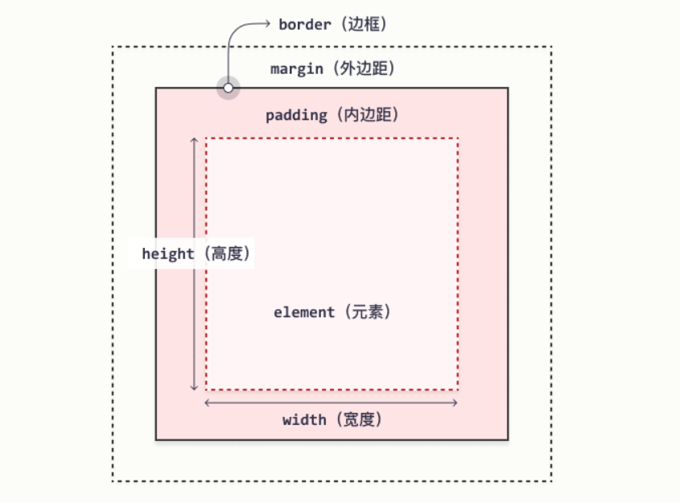
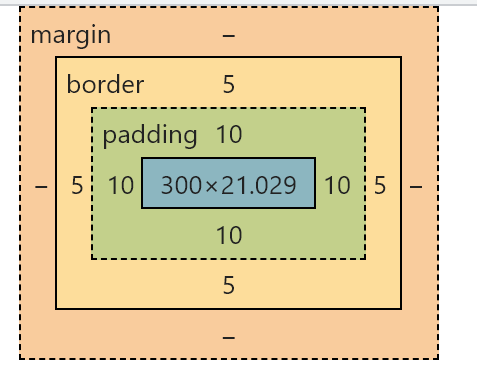

# css盒子模型（Box Model)

CSS盒模型本质上是一个盒子，封装周围的HTML元素，它包括：边距，边框，填充，和实际内容。




- **Margin(外边距)** - 清除边框外的区域，外边距是透明的。

- **Border(边框)** - 围绕在内边距和内容外的边框。

- **Padding(内边距)** - 清除内容周围的区域，内边距是透明的。

- **Content(内容)** - 盒子的内容，显示文本和图像。

  


### 计算元素的宽度和高度

使用 CSS 设置元素的 width 和 height 属性时，只需设置内容区域的宽度和高度。要计算元素的完整大小，还必须把内边距、边框和外边距加起来。

```
div{
    width: 300px;
    padding: 10px;
    border: 5px solid greenyellow;
}
```



元素的总宽度 = width（元素设定的宽度）+左内边距 + 右内边距 + 左边框 + 右边框 + 左外边距 + 右外边距；

元素的总高度 = height（元素设定的高度） + 上内边距 + 下内边距 + 上边框 + 下边框 + 上外边距 + 下外边距；


### 边框会影响盒子的实际大小

```
div{
    width: 200px;
    height: 200px;
    background: red;
    border: 10px solid black;
}
```

1、测量盒子大小的时候，不量边框。

2、如果测量的时候包含了边框，则需要width/height减去边框。


# 盒子模型内边距padding

==padding==属性用于设置内边距，边框与内容之间的距离。

```
padding-top:10px;
padding-right: 20px;
padding-bottom: 0;
padding-left: 3px;


padding:属性，设置内边距，边框与内容之间的距离。

属性值：数值类型，单位是px。
```


#### padding的复合写法（简写）

```
padding:55px 5px 10px 10px;
```


#### 案例：

https://www.sina.com.cn/	(新浪导航栏书写)

使用所学的标签来显示此导航栏效果，理解padding内边距属性的的意思。


1、上边框为3像素，颜色为#ff8500

2、下边框为1像素，颜色为#edeef0

3、盒子高度为41像素，背景颜色为#fcfcfc

4、文字颜色为#4c4c4c


##### 代码：

```
<style type="text/css">
    .nav{
        height: 41px;
        border-top:3px solid #ff8500;
        border-bottom:1px solid #edeef0;
        background: #fcfcfc;
        line-height: 41px;
        font-size: 12px;
    }
    .nav a{
        color: #4c4c4c;
        text-decoration: none;
        display: inline-block;
        padding:0 10px;
    }
    .nav a:hover{
        color: orange;
        background:rgb(237, 238, 240);
    }
</style>
</head>
<body>
    <div class="nav">
        <a href="#">设为首页</a>
        <a href="#">手机新浪网</a>
        <a href="#">移动客户端</a>
    </div>
```


#### padding的值会影响盒子的大小。

1、如果盒子本身没有指定width/height属性，则此时padding不会撑开盒子大小。

- ​	给元素设置height高度属性后，如果给padding值后，在不设置元素width长度的情况下，盒模型的总长度值不会增加。

  ```
      <style type="text/css">
          h1{
              height: 100px;
              background: rosybrown;
              padding: 20px;
          }
      </style>
  </head>
  <body>
      <h1>
  
      </h1>
  ```

  

# 盒子模型外边距margin

margin属性用于设置外边距，即控制盒子与盒子之间的距离。


| 属性          | 作用     |
| ------------- | -------- |
| margin-top    | 上外边距 |
| margin-right  | 右外边距 |
| margin-bottom | 下外边距 |
| margin-left   | 左外边距 |

margin效果距离演示：https://www.mi.com/ 


### margin的复合写法（简写）

```
margin: 10px 20px 30px 40px;
```


| 值的个数                     | 表达的意思                                                   |
| ---------------------------- | ------------------------------------------------------------ |
| margin：5px;                 | 1个值，代表上下左右都有5px像素的外边距                       |
| margin：4px 10px;            | 2个值，代表上下外边距是4px像素，左右外边距是10px像素         |
| margin：4px 10px 20px；      | 3个值，代表上外边距是4px像素，左右外边距是10px像素，下边距是20px像素 |
| margin：4px 10px 20px 30px； | 4个值，上的4px像素，右是10px像素，下是20px像素，左是30像素   |


### 外边距的典型应用

外边距可以让块级盒子水平居中，但是必须满足两个条件

1、盒子必须指定宽度width。

2、盒子左右的外边距都设置为auto。

```
  /* 第一种写法 */
  margin-left: auto;margin-right: auto;
  /* 第二种写法 */
  margin: 0 auto;
  /* 第三种写法 */
  margin: auto;
```

注意：以上方法是让块级元素水平居中，行内元素或者行内块元素水平居中给其父元素添加==text-align：center==即可。


### 解决：嵌套块元素垂直外边距的塌陷

对于两个嵌套关系（父子关系）的块元素，父元素有上外边距同时子元素也有外边距，此时父元素会塌陷较大的外边距值。

```
        .father{
            width: 400px;
            height: 400px;
            background: blue;
            margin: 40px;
        }
        .son{
            width: 150px;
            height: 150px;
            background: red;
            margin: 20px;
        }
    </style>
</head>
<body>
    <div class="father">
        <div class="son"></div>
    </div>
```

解决方案：

1. 给父元素定义上边框。

   ```
   border-top: 1px solid transparent;
   ```

​	2.给父元素定义上边距。

```
padding-top: 10px;
```

​	3.可以给父元素添加overflow：hidden。

```
overflow: hidden;
```


# 清除内外边距

网页元素很多都带有默认的内外边距，而且不同的浏览器默认值也不一致。因此我们布局前，首先要清除下网页元素的内外边距。


```
<ul>
    <li>内容</li>
    <li>内容</li>
    <li>内容</li>
    <li>内容</li>
</ul>
```


### 解决方法：

使用通配符（*），将所有元素的margin、padding都设置为0。

```
*{
    margin: 0;    /* 清除外边距 */
    padding: 0;		/* 清除内边距 */
}
```

注意：行内元素为了照顾兼容性，尽量只设置左右内外边，不要设置上下内外边距。如果转换为行内块或者块级元素，就可以了。