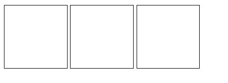
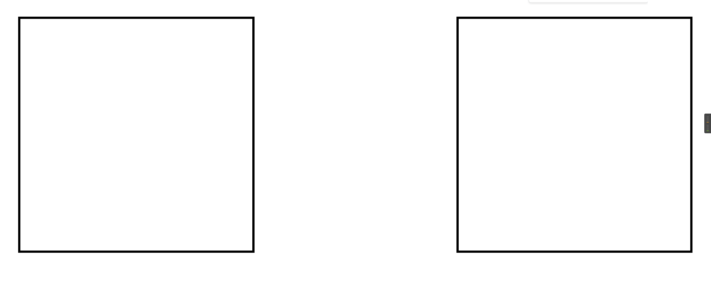
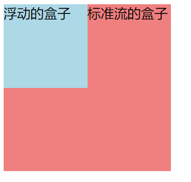
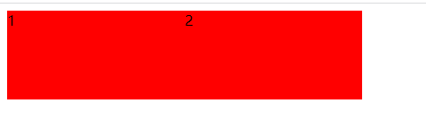
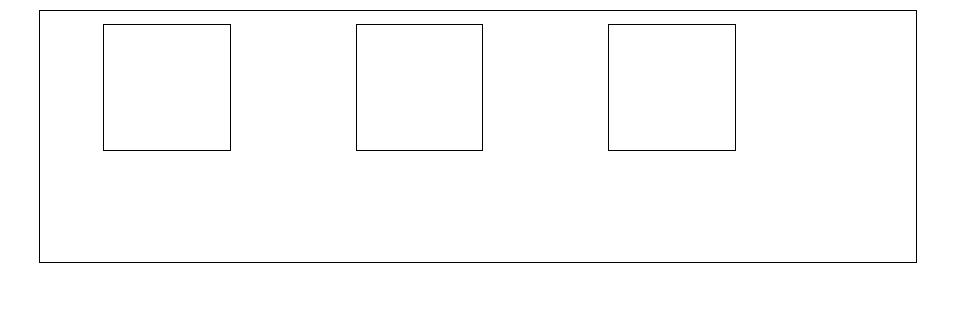
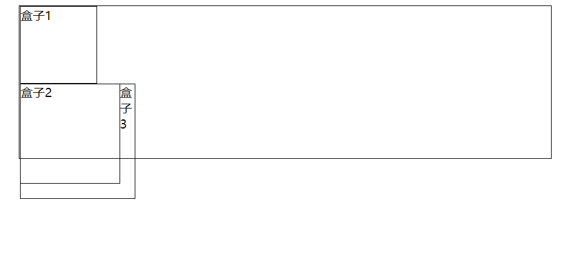
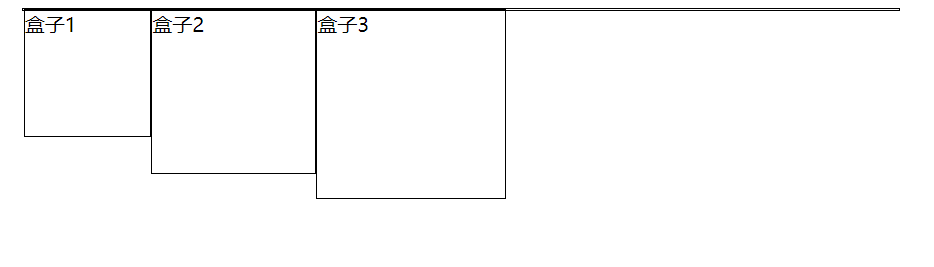
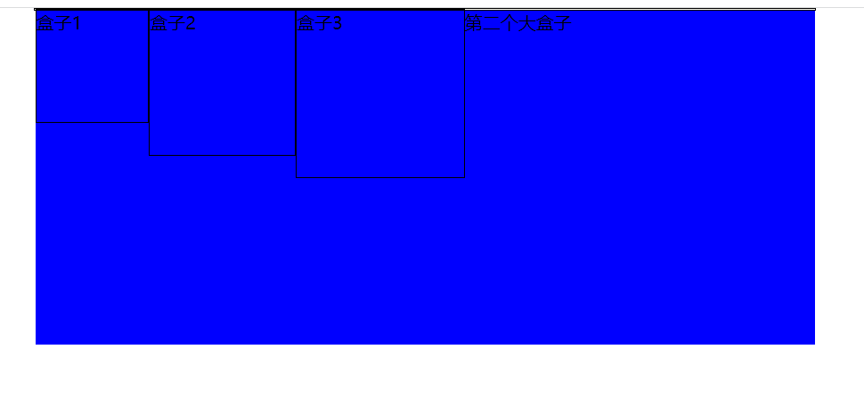

### 浮动


### 传统网页布局的三种方式

网页布局的本质——用css来摆放盒子。把盒子摆放到相应的位置。

css提供了三种传统布局方式（简单来说，就是盒子如何进行排列顺序）

- 普通流（标准流）
- 浮动
- 定位


#### 标准流（普通流/文档流）

标签按照规定好的默认方式排列。

1、块级元素会独占一行，从上向下顺序排列。

​	常见元素：div、hr、p、h1-h6、ul、ol、dl、form、table等

2、行内元素会按照顺序，从左到右顺序排列，碰到父元素边缘自动换行。

​	常见元素：span、a、i、em等


标准流是最基本的布局方式



```
    <style type="text/css">
        div{
            width: 100px;
            height: 100px;
            border: 1px solid black;
            display: inline-block;
        }
    </style>
</head>
<body>
    <div></div>
    <div></div>
    <div></div>
</body>
```


### 为什么需要浮动

使用标准流无法实现左右对齐效果，有很多布局效果，标准流没有办法完成。此时可以利用浮动完成布局，因为浮动可以改变元素标签的默认方式。



```
    <style type="text/css">
        div{
            width: 100px;
            height: 100px;
            border: 1px solid black;
        }
        .a{
            float: right;
        }
    </style>
</head>
<body>
    <div class="a"></div>
    <div class="b"></div>
</body>
```

浮动最典型的应用：可以让多个块级元素一行内排列显示。

网页第一准则：多个块级元素纵向排列标准流，多个块级元素横向排列找浮动。


### 浮动的属性及属性值

语法：

```
.a{
    float: left;
}

选择器{
    float: 属性值;
}
```


| 属性值 | 描述                 |
| ------ | -------------------- |
| none   | 元素不浮动（默认值） |
| left   | 元素向左浮动         |
| right  | 元素向右浮动         |

### 浮动的特性

设置了浮动float的元素最重要的特性

1、脱离标准普通流的控制，移动到指定位置。

2、浮动的盒子不再保留原先的位置。




```
    <style type="text/css">
        .a{
            width: 100px;
            height: 100px;
            background: lightblue;
            float: left;
        }
        .b{
            width: 200px;
            height: 200px;
            background: lightcoral;
        }
    </style>
</head>
<body>
    <div class="a">浮动的盒子</div>
    <div class="b">标准流的盒子</div>
</body>
```


3、浮动元素会具有行内块元素的特性。（任何元素都可以设置浮动属性，行内元素设置浮动后，也会具有行内块元素的特性。）

例子：使用span标签添加浮动属性，展现span标签具有行内块的效果。



```
    <style type="text/css">
        span{
            float: left;
            width: 200px;
            height: 100px;
            background: red;
        }
    </style>
</head>
<body>
    <span>1</span>
    <span>2</span>
</body>
```

注意：如果行内元素有了浮动，则不需要转换块级/行内元素就可以直接给高度和宽度。

4、浮动的盒子中间是没有缝隙的，是紧挨着一起的。


### 浮动元素经常和标准流父级搭配使用

为了约束浮动元素的位置，我们网页布局一班采取的策略是：

先用标准流的父元素排列上下位置，之后内部子元素采取浮动排列左右位置。




```
    <style type="text/css">
        .box{
            width: 700px;
            height: 200px;
            border: 1px solid black;
            margin: 0 auto;
        }
        .box_a{
            width: 100px;
            height: 100px;
            border: 1px solid black;
            float: left;
            margin: 10px 50px;  
        }
    </style>
</head>
<body>
    <div class="box">
        <div class="box_a"></div>
        <div class="box_a"></div>
        <div class="box_a"></div>
    </div>
</body>
```

案例：https://www.mi.com/index.html     


### 一个元素浮动了，理论上其他的兄弟元素也要浮动

一个盒子里面有多个盒子，如果其中一个盒子浮动了，那么其他兄弟元素也应该浮动，以防止引起布局变乱的问题。

浮动的盒子只会影响盒子后面的标准流，不会影响前面的标准流。




```
    <style type="text/css">
        .box{
            width: 700px;
            height: 200px;
            border: 1px solid black;
            margin: 0 auto;
        }
        .box_a1{
            width: 100px;
            height: 100px;
            border: 1px solid black;
        }
        .box_a2{
            width: 130px;
            height: 130px;
            border: 1px solid black;
            float: left;
        }
        .box_a3{
            width: 150px;
            height: 150px;
            border: 1px solid black;
        }
    </style>
</head>
<body>
    <div class="box">
        <div class="box_a1 fl">盒子1</div>
        <div class="box_a2">盒子2</div>
        <div class="box_a3">盒子3</div>
    </div>
</body>
```


### 清除浮动


#### 为什么要清除浮动

之前浮动元素有一个标准流的父元素，都用一个共同点，都是有设置高度的。


正常网页开发中，对于父元素的div的高度大部分情况下，高度都是根据子元素的内容撑开的。


但是，如果父元素不设置高度的情况下，其子元素进行浮动后。父元素的高度因为子元素进行浮动脱离了文档流。所以父元素的高度在标准流里默认成了0px。

就会产生如下效果。（父元素的高度成了0px）



```
    <style type="text/css">
        .box{
            width: 700px;
            border: 1px solid black;
            margin: 0 auto;
        }
        .box_a1{
            width: 100px;
            height: 100px;
            border: 1px solid black;
            float: left;
        }
        .box_a2{
            width: 130px;
            height: 130px;
            border: 1px solid black;
            float: left;
        }
        .box_a3{
            width: 150px;
            height: 150px;
            border: 1px solid black;
            float: left;
        }
    </style>
</head>
<body>
    <div class="box">
        <div class="box_a1 fl">盒子1</div>
        <div class="box_a2">盒子2</div>
        <div class="box_a3">盒子3</div>
    </div>
</body>
```


如果在第一个高度为0的盒子后面再加入其他盒子的话，就会产生如下效果。严重影响网页布局的效果。



```
    <style type="text/css">
        *{
            margin: 0 auto;
        }
        .box{
            width: 700px;
            border: 1px solid black;
        }
        .box_a1{
            width: 100px;
            height: 100px;
            border: 1px solid black;
            float: left;
        }
        .box_a2{
            width: 130px;
            height: 130px;
            border: 1px solid black;
            float: left;
        }
        .box_a3{
            width: 150px;
            height: 150px;
            border: 1px solid black;
            float: left;
        }
        .box2{
            width: 700px;
            height: 300px;
            background: blue;
        }
    </style>
</head>
<body>
    <div class="box">
        <div class="box_a1 fl">盒子1</div>
        <div class="box_a2">盒子2</div>
        <div class="box_a3">盒子3</div>
    </div>
    <div class="box2">
        第二个大盒子
    </div>
</body>
```


#### 如何清除浮动

清除浮动的本质：清除浮动元素造成的影响。

语法：

```
选择器{
    clear： 属性值;
}
```


| 属性值             | 描述                                       |
| ------------------ | ------------------------------------------ |
| left               | 不允许左侧有浮动元素（清除左侧浮动的影响） |
| right              | 不允许右侧有浮动元素（清除右侧浮动的影响） |
| both（使用率最高） | 同时清除左右两侧浮动的影响                 |

##### 清除浮动的方法

###### 1、清除浮动——额外标签法

额外标签法也称为隔墙法，是常用的推荐做法。

额外标签法会在浮动元素末尾添加一个空的标签（空标签必需是块级元素。）。例如：`<div style="clear: both;"></div>`，或者其他标签（标签必需是块级元素）

优点：通俗易懂，书写方便。

缺点：添加许多无意义的标签，容易影响标签结构观感。

```
    <style type="text/css">
        *{
            margin: 0 auto;
        }
        .box{
            width: 700px;
            border: 1px solid black;
        }
        .box_a1{
            width: 100px;
            height: 100px;
            border: 1px solid black;
            float: left;
        }
        .box_a2{
            width: 130px;
            height: 130px;
            border: 1px solid black;
            float: left;
        }
        .box_a3{
            width: 150px;
            height: 150px;
            border: 1px solid black;
            float: left;
        }
        .box2{
            width: 700px;
            height: 300px;
            background: blue;
        }
    </style>
</head>
<body>
    <div class="box">
        <div class="box_a1 fl">盒子1</div>
        <div class="box_a2">盒子2</div>
        <div class="box_a3">盒子3</div>
        <div style="clear: both;"></div>
    </div>
    <div class="box2">
        第二个大盒子
    </div>
</body>
```


###### 2.清除浮动——给父级添加overflow

语法：

```
选择器{
    overflow: 属性值;
}
```

给**父级**添加overflow属性，将其属性值设置为hidden、auto、或者scroll

优点：代码简洁，不像第一种方法，不影响网页代码标签观感。

缺点：无法显示溢出部分。（后期会对此属性进行详细讲解。）


###### 3.清除浮动——:after伪元素法

:after方式是额外标签法的升级版，也是给**父元素**添加，不过是添加css属性并非标签。

```
.clearfix::after{
    content:"";
    display: block;
    height: 0;
    clear: both;
    visibility: hidden;
}
.clearfix{
    /* IE6、7 */
    *zoom: 1;
}
```

优点；没有增加标签，结构更简单

缺点：照顾低版本浏览器，增加代码量


#### 清除浮动总结

为什么要清除浮动

1、父级没高度

2、子盒子浮动了。

3、影响下面元素的布局，需要清除浮动，保持页面整洁。


| 清除浮动的方式       | 优点               | 缺点                                 |
| -------------------- | ------------------ | ------------------------------------ |
| 额外标签法           | 通俗易懂，书写方便 | 添加许多无意义的标签，结构化较差     |
| 父级overflow：hidden | 书写简单           | 溢出隐藏                             |
| 父级after伪元素      | 结构语义化正确     | 由于IE6-7不支持：after，兼容性问题。 |

