# 定位

### 为什么需要定位

1、让某个元素可以自由的在一个盒子内移动位置，并且压住其他盒子。

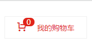

网址链接：https://www.jd.com/  京东购物车角标固定


2、当我们滚动窗口的时候，盒子是固定到屏幕的某个位置的。


网址链接：https://www.jd.com/  京东导航栏固定

注意：以上效果，标准流或浮动都无法快速实现，此时则需要定位来实现。


### 定位的组成

定位：将盒子定在某一位置，所以定位也是摆放盒子，按照定位的方式移动盒子。

定位**定位模式**+**边偏移**。

定位模式用于指定一个元素的网页中的定位方式，偏移位置则决定了元素的最终位置。


### 定位模式

定位模式决定元素的定位方式，它通过css的**position**属性来设置，属性值可以分为四个。


| 属性值   | 语义描述 |
| -------- | -------- |
| static   | 静态定位 |
| relative | 相对定位 |
| absolute | 绝对定位 |
| fixed    | 固定定位 |

### 边偏移

边偏移就是定位的盒子移动到的最终位置。有top、bottom、left、right这4个属性。


| 变偏移属性 | 实例        | 描述                                               |
| ---------- | ----------- | -------------------------------------------------- |
| top        | top:80px    | 顶部偏移量，定义元素相对于其父元素的上边线的距离   |
| bottom     | bottom:80px | 底部偏移量，定义元素相对于其父元素的下边线的距离   |
| left       | left:80px   | 左侧偏移量，定义元素相对于其父元素的左边线的距离。 |
| right      | right:80px  | 右侧偏移量，定义元素相对于其父元素的右边线的距离。 |


### 静态定位static（了解）

静态定位是元素的默认定位方式，无定位的意思。

语法

```
    选择器{
        position:static;
    }
```

1、静态定位按照标准流特性进行摆放，没有位置偏移。

2、静态定位在布局时很少用到。


### 相对定位relative（重要）

相对定位是元素在移动位置的时候，是相对于它原来的位置来说的

```
    选择器{
        position:relative;
        top: -10px;
        left: -30px;
    }
```

相对定位的特点：

1、它是相对于自己原来的位置来移动的（移动位置的时候参照点是自己原来的位置）

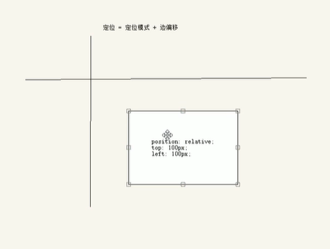

```
        <style>
            div{
                width: 300px;
                height: 300px;
                border: 1px solid black;
            }
            .one{ 
                position: relative;
                top: -10px;
                left: -30px;
            }
        </style>
    </head>
    <body>
        <div class="one">

        </div>
    </body>
```

2、原来在标准流的位置继续占有，（不会跟浮动一样），后面的盒子仍然以标准流的方式对待它。（不脱离标准位置，继续保留原来）


### 绝对定位absolute（重要）

绝对定位是元素在移动位置的时候，是相对于它祖先元素来说的。

语法：

```
    选择器{
        position:absolute;
    }
```

绝对定位的特点：

##### 1、如果没有祖先元素或者祖先元素没有定位，则浏览器为准定位（Document文档）


例子：没有祖先元素的例子

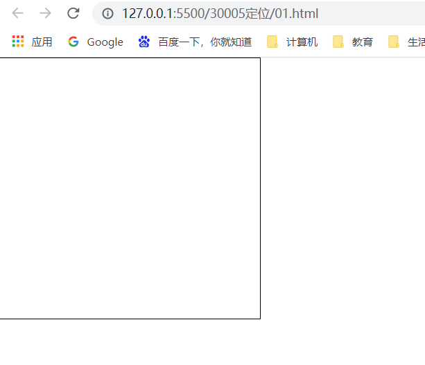

```
        .one{ 
            width: 300px;
            height: 300px;
            border: 1px solid black;
            position: absolute;
            top: 0;
            left: 0;
        }
```


例子：有祖先元素，但是没有祖先元素没有定义定位的。

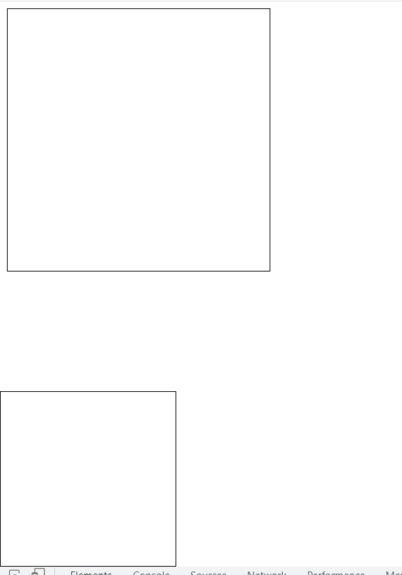


代码块

```
          <style>
              .one{ 
                  width: 300px;
                  height: 300px;
                  border: 1px solid black;
                  right: 0;
                  bottom: 0;
              }
              .two{
                  width: 200px;
                  height: 200px;
                  border: 1px solid black;
                  position: absolute;
                  bottom: 0;
                  left: 0;
              }
          </style>
      </head>
      <body>
          <div class="one">
              <div class="two"></div>
          </div>
      </body>
```


##### 2、如果祖先元素有定位（相对、绝对、固定定位），则以最近一级的有定位属性的祖先元素为参考点移动位置。


例子：父元素有定位，子元素进行相对定位时，只会在父元素内进行位置移动。

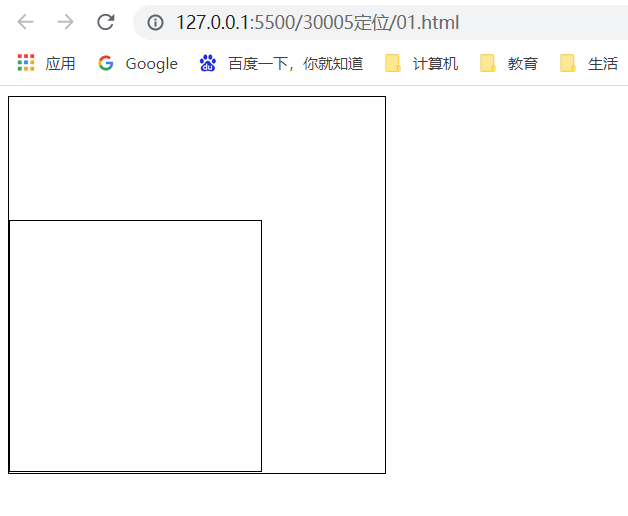

例子：三级嵌套，第二级元素没有设置定位属性，第一级元素设置定位属性，第三层会按照谁的位置走。


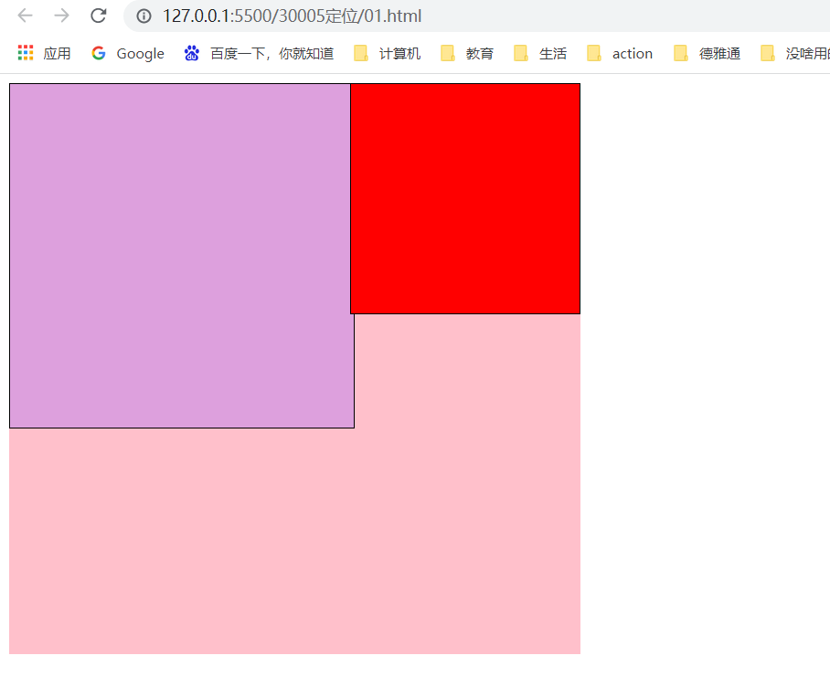

```
    <style>
        .box{
            width: 500px;
            height: 500px;
            position:absolute;
            background: pink;
        }
        .one{ 
            width: 300px;
            height: 300px;
            border: 1px solid black;
            background: plum;
        }
        .two{
            width: 200px;
            height: 200px;
            border: 1px solid black;
            position: absolute;
            background: red;
            top: 0;
            right: 0;
        }
    </style>
</head>
<body>
    <div class="box">
        <div class="one">
            <div class="two"></div>
        </div>
    </div>
</body>
```


例子：如果第一级元素和第二级元素都有定位属性，第三级元素会按照最近有定位元素的进行位置判定。


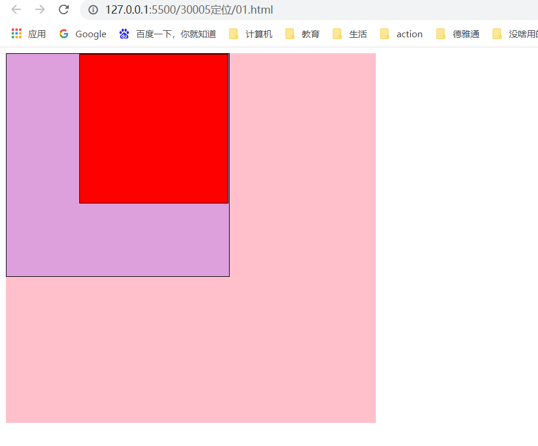

```
        <style>
            .box{
                width: 500px;
                height: 500px;
                position:relative;
                background: pink;
            }
            .one{ 
                width: 300px;
                height: 300px;
                border: 1px solid black;
                background: plum;
                position: relative;
            }
            .two{
                width: 200px;
                height: 200px;
                border: 1px solid black;
                position: absolute;
                background: red;
                top: 0;
                right: 0;
            }
        </style>
    </head>
    <body>
        <div class="box">
            <div class="one">
                <div class="two"></div>
            </div>
        </div>
    </body>
```

##### 3、绝对定位不再占有原先的位置（脱离标准流）

例子：第二个div元素设置绝对定位后，会产生浮动效果。后面第三个div的元素会按照标准流走。从而产生覆盖效果。

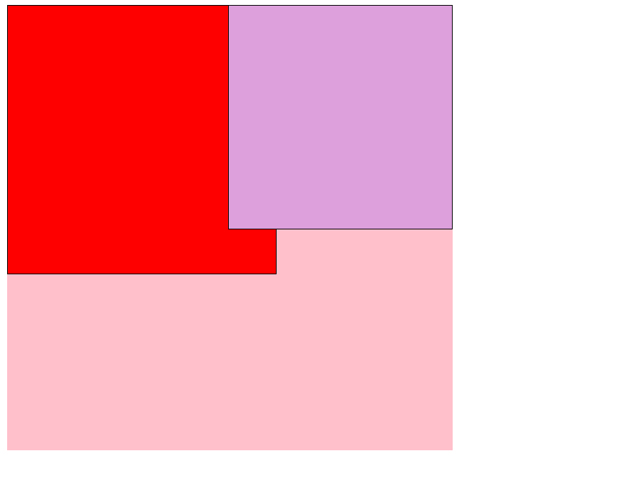

```
          <style>
              .box{
                  width: 500px;
                  height: 500px;
                  position:relative;
                  background: pink;
              }
              .one{ 
                  width: 250px;
                  height: 250px;
                  border: 1px solid black;
                  background: plum;
                  position: absolute;
                  right: 0;
                  top: 0;
              }
              .two{
                  width: 300px;
                  height: 300px;
                  border: 1px solid black;
                  background: red;
              }
          </style>
      </head>
      <body>
          <div class="box">
              <div class="one"></div>
              <div class="two"></div>
          </div>
      </body>
```

总结：

1、如果没有祖先元素者祖先元素没有定位，则浏览器为准定位（Document文档）

2、如果祖先元素有定位（相对、绝对、固定定位），则以最近一级的有定位属性的祖先元素为参考点移动位置。

3、绝对定位不再占有原先的位置（脱离标准流）


### 固定定位fixed（重要）

固定定位是元素固定于浏览器可视区的位置，主要使用场景：一般用于浏览器页面滚动时元素的位置不会改变。

例子：https://pvp.qq.com/    王者荣耀侧边导航栏固定案例


语法：

```
        选择器{
            position: fixed;
        }
```

固定定位的特点

1、以浏览器的可视窗口为参照点移动元素。

- ​	跟父元素没有任何关系。
- ​    不随滚动条滚动。

2、固定定位不在占有原先的位置（脱标）

- 固定定位也是脱离标准流的。


例子：总是以浏览器的可视窗口进行对齐。

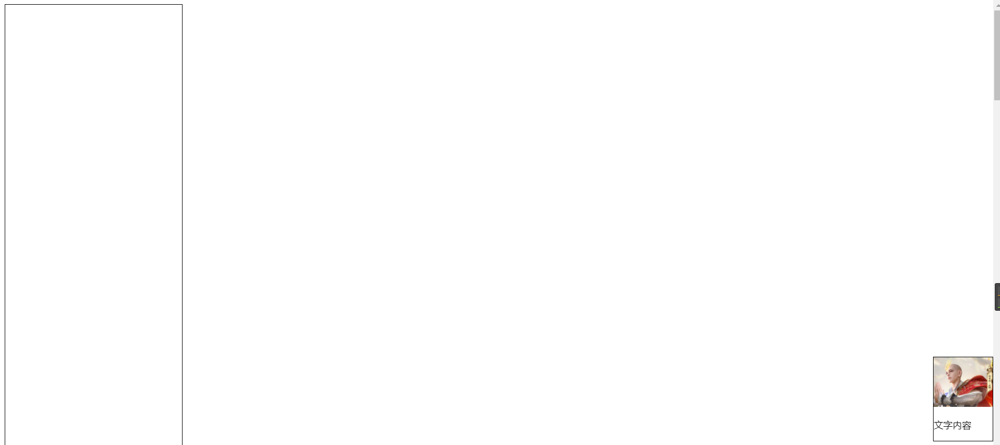

```
    <style>
        .one{
            position: fixed;
            right: 0;
            bottom: 50px;
            border:1px solid black;
        }
    </style>
</head>
<body>
    <div class="one">
        
        <p>文字内容</p>
    </div>
    <div style="width: 300px;height: 4000px;border: 1px solid black;"></div>
</body>
```


#### 固定定位小技巧：利用百分比进行位置定位

算法：（利用固定定位，让固定的盒子保持在中心盒子的右侧）

1、让固定定位的盒子left：50%，走到浏览器可视区（也可以看做版心）的一半位置。

2、让固定定位的盒子margin-left：版心宽度的一半距离。


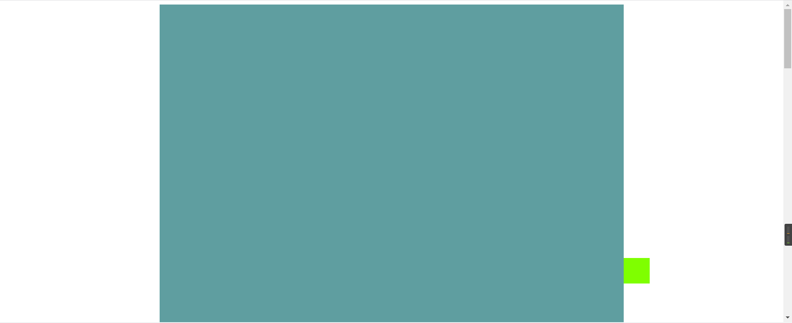

```
    <style type="text/css">
        .box{
            width: 900px;
            height: 3200px;
            background: cadetblue;
            margin: 0 auto;
        }
        .fix{
            width: 50px;
            height: 50px;
            background: chartreuse;
            position: fixed;
            left: 50%;
            top: 80%;
            margin-left: 450px;
        }
    </style>
</head>
<body>
    <div class="box"></div>
    <!-- 需要固定定位的右侧上浮栏 -->
    <div class="fix"></div>
</body>
```


作业：https://news.sina.com.cn/			新浪新闻左右两侧广告栏

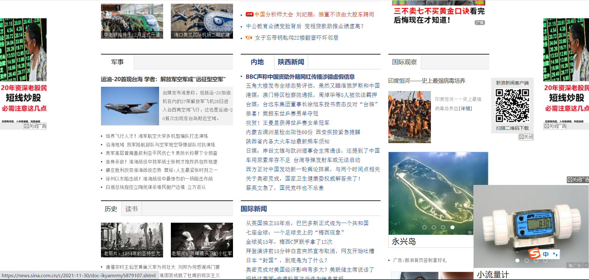


### 粘性定位sticky（了解）

粘性定位可以被认为是相对定位和固定定位的混合。

语法：

```
        选择器{
            position: sticky;
        }
```

粘性定位的特点：

1、以浏览器的可视窗口为参照点移动元素（固定定位特点）。

2、粘性定位占有原先的位置（相对定位特点）。

3、必需添加top、left、right、bottom其中一个才有效，跟页面滚动搭配使用。


缺点：兼容性，ie不支持。（只适合做导航栏，不适合做侧边栏的条件判断，大部分情况下，导航栏固定还是依靠绝对定位加==js==条件进行判断）


例子：固定导航栏，当页面滚动到可视窗口的距离为0时，进行固定。

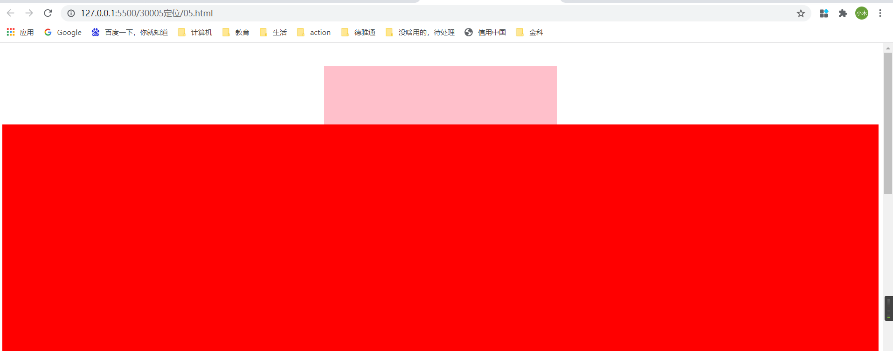

```
    <style type="text/css">
        .nav{
            width: 400px;
            height: 100px;
            background: pink;
            margin: 0 auto;
            margin-top: 40px;
            position: sticky;
            top: 0;
        }
    </style>
</head>
<body>
    <div class="nav"></div>
    <div style="height: 1900px;background: red;"></div>
</body>
```


### 关于定位总结


| 定位模式         | 是否脱标         | 移动位置           | 是否常用           |
| ---------------- | ---------------- | ------------------ | ------------------ |
| static静态模式   | 否               | 不能使用变偏移     | 很少               |
| relative相对定位 | 否（占有位置）   | 相对于自身位置移动 | 常用               |
| absolute绝对定位 | 是（不占有位置） | 带有定位的父级     | 常用               |
| fixed固定定位    | 是（不占有位置） | 浏览器可视区       | 常用               |
| sticky粘性定位   | 否（占有位置）   | 浏览器可视区       | 当前阶段使用非常少 |


