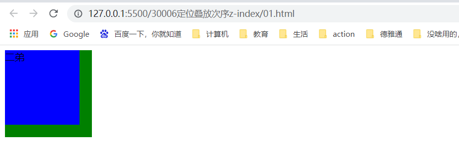

### 定位叠放次序 z-index


在使用定位布局时，可能会出现盒子重叠的情况。此时，可以使用z-index来控制盒子的前后次序（z-轴）

语法：

```
选择器{
	z-index：1；
}
```

- 数值可以是正整数、负整数或0，默认是auto，数值越大，盒子越靠上。
- 如果属性值相同，则按照书写顺序，后来居上。
- 数字后面不能加单位。
- 只有定位的盒子才有z-index属性。


例子：


三个div盒子，都设置了绝对定位，会产生重叠效果，利用`z-index`属性进行顺序显示。





```
    <style>
        .one{
            position:absolute;
        }
        .a{
            width: 100px;
            height: 100px;
            background: red;
            z-index: 2;
        }   
        .b{
            width: 120px;
            height: 120px;
            background: blue;
            z-index: 3;
        }
        .c{
            width: 140px;
            height: 140px;
            background: green;
            z-index: 1;
        }
    </style>
</head>
<body>
    <div class="a one">大哥</div>
    <div class="b one">二弟</div>
    <div class="c one">三弟</div>
</body>
```

