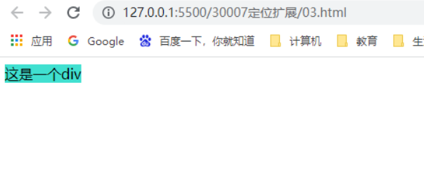

### 绝对定位的盒子居中

加了绝对定位的盒子不能通过margin：0 auto水平居中，但是可以通过以下计算方法实现水平居中和垂直居中。

1、left：50%：让盒子的左侧移动到父级元素的水平中心位置。

2、margin-left：-400px;

​				让盒子向左移动自身宽度的一半。


```
    <style>
        div{
            width: 800px;
            height: 200px;
            background: pink;
            margin: 0 auto;
            /* 添加了绝对定位属性的div，如果设置margin：0 auto；的话，是不生效的。 */
            position:absolute;
            left: 50%;
            margin-left: -400px;
        }
    </style>
</head>
<body>
    <div></div>
</body>
```


### 定位的特殊特性

绝对定位和固定定位也和浮动类似

1、行内元素添加**绝对定位**和**固定定位**，可以设置宽度和高度。


```
    <style>
        span{
            position: absolute;
            background: purple;
            color: white;
            width: 300px;
            height: 300px;
        }
    </style>
</head>
<body>
    <span>文字</span>
</body>
```

2、块级元素添加**绝对定位**或者**固定定位**，如果不给宽度或者高度，默认大小是内容大小。




```
    <style>
        div{
            position: absolute;
            background: turquoise;
        }
    </style>
</head>
<body>
    <div>这是一个div</div>
</body>
```

3、**绝对定位**（固定定位）会完全压住盒子

​				浮动元素不同，只会压住它下面标准流的盒子，但是不会压住下面标准流盒子里面的文字（图片）

​				但是绝对定位（固定定位）会压住下面标准流所有的内容

​				浮动不会压住文字，是因为浮动产生的目的是为了做文字环绕效果的。


```
    <style>
        .one{
            width: 300px;
            height: 300px;
            background: yellowgreen;
            /* float: left; */
            /* 使用浮动属性候，虽然p标签的因为div浮动，位置进行了上移，但是文字内容会显示出来 */
            position: absolute;
        }
    </style>
</head>
<body>
    <div class="one"></div>
    <p>这是一个p标签，亦是一串文字,这是一个p标签，亦是一串文字，这是一个p标签，亦是一串文字，这是一个p标签，亦是一串文字</p>
</body>
```

