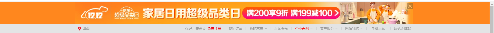
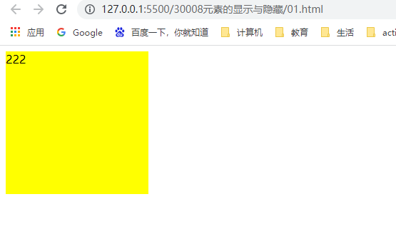
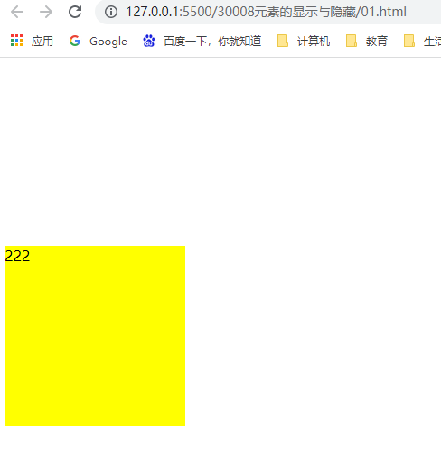

## 元素的显示与隐藏

类似网站广告，当我们点关闭就不见了，但是我们重新刷新页面，会重新出现！


例子：网页链接	

https://www.jd.com/?cu=true&utm_source=baidu-pinzhuan&utm_medium=cpc&utm_campaign=t_288551095_baidupinzhuan&utm_term=0f3d30c8dba7459bb52f2eb5eba8ac7d_0_72e7cfd2ad724119b209accca8605abe





本质：让一个元素在页面中隐藏或者显示出来。


### display属性

display属性用于设置一个元素应该如何显示

- display：none; 		隐藏元素
- display：block；      除了转换块级元素之外，同时还有显示元素的意思。

display隐藏元素后，不再占有原来的位置

此属性后面应用及其广泛，搭配js可以做很多的网页特效。




```
    <style>
        div{
            width: 200px;
            height: 200px;
        }
        .a{
            background: violet;
            display: none;
        }
        .b{
            background: yellow;
        }
    </style>
</head>
<body>
    <div class="a">111</div>
    <div class="b">222</div>
</body>
```


### visibility可见性


例子：css设置属性为visibility，属性值设置为hidden，以下为产生的效果



```
        <style>
            div{
                width: 200px;
                height: 200px;
            }
            .a{
                background: violet;
                visibility: hidden;
                /* 元素可视 */
            }
            .b{
                background: yellow;
            }
        </style>
    </head>
    <body>
        <div class="a">111</div>
        <div class="b">222</div>
    </body>
```


**visibility**属性用于指定一个元素应该是可见还是隐藏。

visibility: hidden;					/* 元素隐藏，保留位置 */

visibility: visible; 					/* 元素可视 */

**visibility隐藏元素后，继续占有原来的位置**


### 总结	

如果隐藏元素想要原来的位置，就用visibility: hidden;

如果隐藏元素不想要原来的位置，就用display：none（用处更多，重点记忆）


