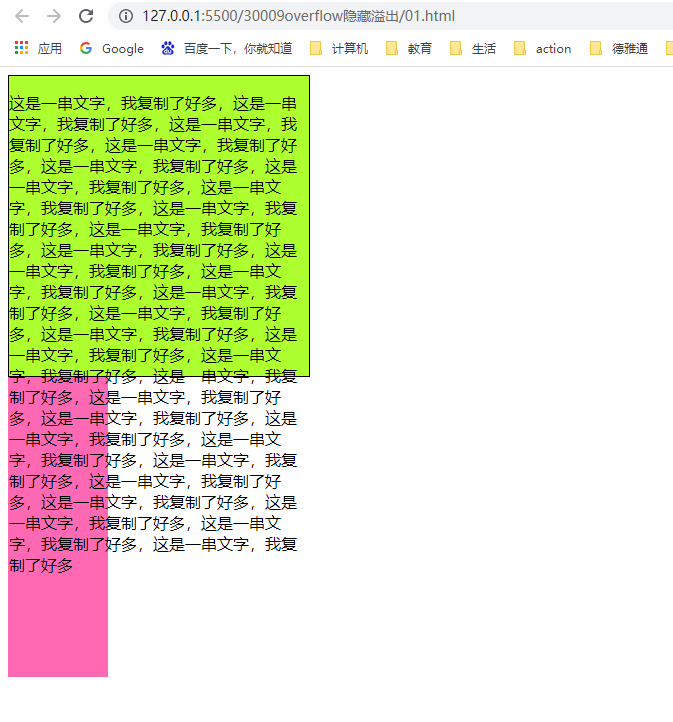
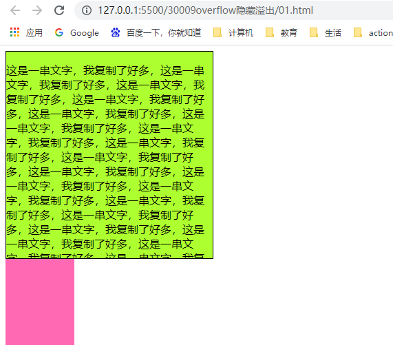
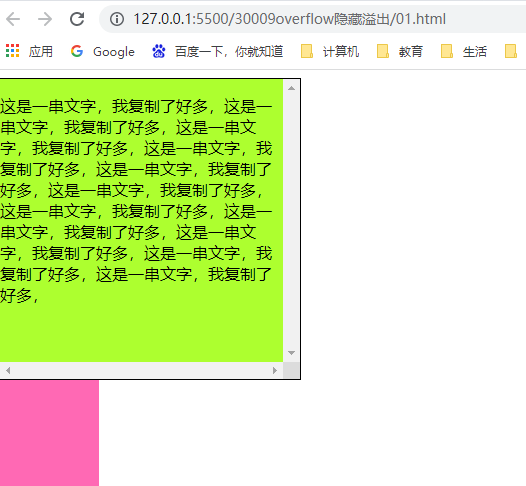
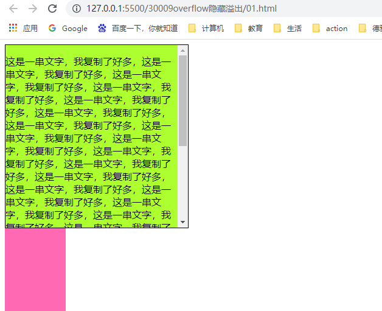
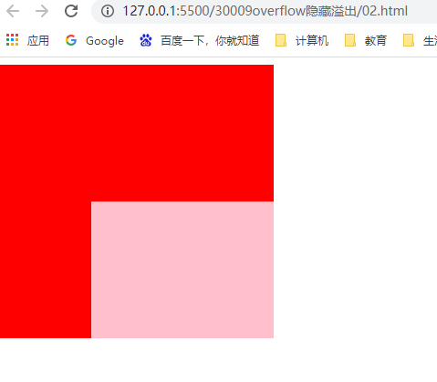

### overflow溢出

overflow属性指定了如果内容溢出一个元素的框（超过其指定的高度及宽度）时，会发生什么状况。


例子：给div设置固定的宽高值后，如果文字超出了div的高度内容，会产生溢出。




```
    <style>
        .one{
            width: 300px;
            height: 300px;
            border: 1px solid black;
            background: greenyellow;
        }
        .two{
            width: 100px;
            height: 300px;
            background: hotpink;
        }
    </style>
</head>
<body>
    <div class="one">
        <p>这是一串文字，我复制了好多，这是一串文字，我复制了好多，这是一串文字，我复制了好多，这是一串文字，我复制了好多，这是一串文字，我复制了好多，这是一串文字，我复制了好多，这是一串文字，我复制了好多，这是一串文字，我复制了好多，这是一串文字，我复制了好多，这是一串文字，我复制了好多，这是一串文字，我复制了好多，这是一串文字，我复制了好多，这是一串文字，我复制了好多，这是一串文字，我复制了好多，这是一串文字，我复制了好多，这是一串文字，我复制了好多，这是一串文字，我复制了好多，这是一串文字，我复制了好多，这是一串文字，我复制了好多，这是一串文字，我复制了好多，这是一串文字，我复制了好多，这是一串文字，我复制了好多，这是一串文字，我复制了好多，这是一串文字，我复制了好多，这是一串文字，我复制了好多，这是一串文字，我复制了好多，这是一串文字，我复制了好多，这是一串文字，我复制了好多</p>
    </div>
    <div class="two">

    </div>
</body>
```


| 属性值  | 描述                                                         |
| ------- | ------------------------------------------------------------ |
| visible | 不剪切内容也不添加滚动条                                     |
| hidden  | 不显示超出内容，超出的部分隐藏掉，隐藏的内容在html结构中依旧存在 |
| scroll  | 不管超出内容与否，总是显示滚动条                             |
| auto    | 超出自动显示滚动条，不超出不显示滚动条                       |

 

#### visible属性值（默认值）

不剪切内容也不添加滚动条，默认溢出

```
        .one{
            width: 300px;
            height: 300px;
            border: 1px solid black;
            background: greenyellow;
            overflow: visible;
        }
```


#### hidden  属性值

不显示超出内容，超出的部分隐藏掉，隐藏的内容在html结构中依旧存在




```
        .one{
            width: 300px;
            height: 300px;
            border: 1px solid black;
            background: greenyellow;
            overflow: hidden;
        }
```


#### scroll 属性值

不管超出内容与否，总是显示滚动条



```
        .one{
            width: 300px;
            height: 300px;
            border: 1px solid black;
            background: greenyellow;
            overflow: scroll;
        }
```


#### auto属性值

超出自动显示滚动条，不超出不显示滚动条



```
      .one{
          width: 300px;
          height: 300px;
          border: 1px solid black;
          background: greenyellow;
          overflow: auto;
      }
```


一般情况下，我们都不想让溢出的内容显示出来，因为溢出的部分会影响布局

但是如果有定位的盒子，请慎用overflow：hidden，因为它会隐藏多余的部分。

举例：




```
    <style>
        .one{
            width: 300px;
            height: 300px;
            background: red;
            position: relative;
            overflow: hidden;
        }
        .two{
            width: 200px;
            height: 200px;
            background: pink;
            position: absolute;
            top: 150px;
            left: 100px;
        }
    </style>
</head>
<body>
    <div class="one">
        <div class="two"></div>
    </div>
</body>
```

