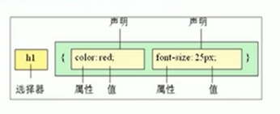
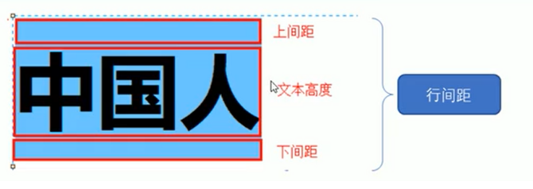

## CSS简介

**CSS**是**层叠样式表**的简称，有时我们也会称之为**CSS样式表**

**CSS**主要用于设置HTML页面中的文本内容（字体、大小、对齐方式等）、图片的外形（宽高、边框样式、边距等）以及版面的布局和外观显示样式

1、**HTML**主要做结构，显示元素内容

2、**CSS**美化HTML，布局网页

3、CSS最大价值：由**HTML**专注去做结构呈现，样式交给**css**，即结构（HTML）与样式（CSS）相分离。


## CSS语法规范

使用HTML时，需要遵从一定的规范，CSS也是如此。想要熟练地使用CSS网页进行修饰，首先要了解**CSS样式规则**

CSS规则主要由两个部分组成：**选择器**以及一条或多条**声明**



- **选择器**是用于指定CSS样式的HTML标签，花括号内是该对象设置的具体样式
- 属性和属性值以“**键值对**”的形式出现
- 属性是对指定的对象设置的样式属性，例如：字体大小、文本颜色等。
- 属性和属性值之间用英文 “:” 分开
- 多个“**键值对**“之间用英文“；”进行区分


### CSS代码风格

①紧凑格式

```
h3{color: pink;font-size: 20px;}
```

②展开格式（推荐第二种格式，可读性比较强）

```
h3{
    color: pink;
    font-size: 20px;
}
```


## CSS引入方式

css有三种引入方式

1、行内样式表（行内式）

2、内部样式表（嵌入式）

3、外部样式表（链接式）


#### 内部样式表

内部样式表是写到HTML页面内部，是将所有 CSS 代码抽取出来，单独放到一个`<style>`标签中

```
    <style>
        div{
            color: rebeccapurple;
        }
    </style>
```

- `<style>`标签理论上可以放在HTML文档得任何地方，但一般会放在文档的`<head>`标签中

  

#### 行内样式表

行内样式表（内联样式表）是在元素标签内部的 style 属性中设定 CSS 样式，适合修改简单样式

```
<div style="color: red;font-size: 18px;">我是div</div>
```

- style其实就是标签的属性

- 属性值需要写在双引号中间，写法要复合 CSS 规范

  

#### 外部样式表（外连）

实际开发都是外部样式表居多，适合于样式比较多的情况下。通过外部引入的方式将文件引入到HTML页面中。


引入外部样式表分为两个：
		1.新建一个后缀名为  xxx.css 样式的文件，把所有 css 代码都放入此文件中。

2.在HTML页面里的`head`标签中，使用 `<link>` 标签引入这个文件

```
<link rel="stylesheet" href="CSS的文件路径">
```

| 属性 | 作用                                                         |
| ---- | ------------------------------------------------------------ |
| rel  | 定义当前文档与被链接文档之间的关系，这里需要指定为  stylesheet |
| href | 定义所链接外部样式表文件的路径，可以能是相对路径，也可以是绝对路径 |


## CSS选择器

```
    <div>我是div</div>
    <p>我是段落</p>
    <ul>
        <li>我是ul里面的li标签</li>
    </ul>
    <ol>
        <li>我是ol里面的li标签</li>
    </ol>
```

1、如何将div里面的文字改为红色？

2、如何将p标签里面的文字改为蓝色？

3、如果将ul里面的li标签改为绿色？


### CSS选择器的作用

选择器（选择符）就是根据不同需求把不用的标签选出来这就是选择器的作用。简单来说，就是选择标签用的。


以上CSS做了两件事：

1.找到所有h1标签，选择器（选对人）。

2.设置这些标签的样式，比如颜色与红色（做对事）


### 基础选择器

**选择器**分为**基础选择器**和**复合选择器**两个大类，主要先了解基础选择器

- 基础选择器是由**单个选择器**组成的
- 基础选择器又包括：**标签选择器**、**类选择器**、**id选择器**和**通配符选择器**


#### 标签选择器

**标签选择器**（元素选择器）是指用**HTML标签名称**作为选择器，按标签名称分类，为页面中某一类标签指定统一CSS样式

`作用`：标签选择器可以把某一类标签全部选择出来，比如所有`<div>`标签和`<span>`标签。

`优点`：能快速为页面中同类型的标签设置统一样式

`缺点`：不能差异化样式，只能选择全部的当前标签

`例子`

```
div{
    width: 100px;
    height: 200px;
}
```


#### class类选择器

如果想要差异化选择不同的标签，单独选一个或者某几个标签，可以使用**类选择器**

**类选择器**在HTML中以**class属性**表示，在css中，类选择器以一个点 " . " 号显示

例子：

`HTML`

```
<div class="div1">我是div</div>
```

`CSS`

```
.div1{
    color: red;
    font-size: 18px;
}
```


#### id选择器

id选择器可以标有特定id的HTML元素指定特定的样式

HTML元素以 id 属性来设置 id选择器，CSS 中 id选择器以 "#" 来定义

`HTML`

```
<p id="one">我是段落</p>
```

`css`

```
#one{
    color: red;
    font-size: 24px;
}
```


#### 通配符选择器

在CSS中，通配符选择器使用 " * "定义，表示选取页面所有元素（标签）

`CSS`

```
*{
    margin: 0;
    padding: 0;
}
```


#### 基础选择器总结

|              | 用法          |
| ------------ | ------------- |
| 标签选择器   | p{color:red}  |
| 类选择器     | .a{color:red} |
| id选择器     | #a{color:red} |
| 通配符选择器 | *{color:red}  |


### 复合选择器(中)

什么是复合选择器？

在css中，可以根据选择器的类型把选择器分为 **基础选择器**和**复合选择器**，复合选择器是建立在基础选择器之上，对基本选择器进行组合形成的。

- 复合选择器可以耿准确、更高效的选择目标元素（标签）

- 复合选择器是由两个或多个基础选择器，通过不同的方式组合

- 常用的复合选择器包括：后代选择器、子选择器、并集选择器、伪类选择器

  

#### 后代选择器

**后代选择器**又称为**包含选择器**，可以选择父元素里面的子元素，其写法就是把外层标签写在前面，内层标签写在后面的，中间用空格分割。当标签发生嵌套时，内层标签就成为外层标签的后代。

语法：

```
元素1 元素2 {样式声明}
```

上述语法表示 **选择元素1 里面的所有元素2（后代元素）**

`例子`

```
ul li{样式声明}     /* 选择ul里面的所有li标签元素 */
```

- 元素1 和元素2 中间用空格 隔开
- 元素1 是 父级，元素2 是 子级，最终选择的是 元素2
- 元素2 可以是儿子，也可以是孙子，只要是 元素1 的后代即可


#### 子选择器

**子元素选择器**只能选择作为某一元素的最近一级子元素。简单理解就是选亲儿子元素

语法：

```
元素1 >　元素2{样式声明}
```

上述语法表示：选择 元素1 里面的所有直接后代 元素2

`例子`

```
div > p{样式声明} /* 选择div 里面的所有最近一级 p 标签元素*/
```

- 元素1 和元素2 中间用 **大于号** 隔开
- 元素1 是 父级，元素2 是 子级，最终选择的是 元素2
- 元素2 必须是 亲儿子，其 孙子、重孙子之类的都不属于。


#### 并集选择器

并集选择器可以选择多组标签，同时为他们定义相同的样式。通常用于集体声明

并集选择器是各选择器通过英文逗号 ( **,** ) 连接而成，任何形式的选择器都可以作为并集选择器的一部分。

```
元素1,元素2{样式声明}
```

上述语法表示选择 **元素1** 和 **元素2**

`例子`

```
ul,div{样式声明}  /*  选择 ul 和 div 标签元素 */
```

- 元素1 和 元素2 中间用逗号隔开

- 逗号可以理解为 和 的意思

- 并集选择器 通常用于集体声明

  


## CSS字体属性

css Fonts(字体)属性用于定义字体系列、大小、粗细和文字样式(如斜体)


#### font-family字体系列

CSS使用 **font-family** 属性定义文本的字体系列

```
div{
    font-family: 楷体;
}
```


#### font-size字体大小

CSS使用 **font-size**属性定义字体大小

```
div{
    font-size: 20px;
}
```

- px{像素} 大小是我们网页最常用的单位
- 谷歌浏览器默认的文字大小为16px
- 不同浏览器默认显示的字号大小不一致，我们尽量给一个明确值大小，不要默认大小
- 可以给 body 指定整个页面文字的大小


#### font-weight字体粗细

CSS使用 **font-weight** 属性设置文字字体的粗细

```
div{
    font-weight: bold;
}
```

| 属性值  | 描述                                                 |
| ------- | ---------------------------------------------------- |
| normal  | 默认值(不加粗的)                                     |
| bold    | 定义粗体(加粗的)                                     |
| 100-900 | 400等同于normal，而700等同于 bold ，数字后面不带单位 |


#### font-style文字样式

CSS使用 **font-style**属性设置文本的风格

```
div{
    font-style: italic;
}
```

| 属性值 | 作用                               |
| ------ | ---------------------------------- |
| normal | 默认值，浏览器会显示标准的字体样式 |
| italic | 显示斜体的字体样式                 |


#### 字体属性总结

| 属性        | 描述     | 注意点               |
| ----------- | -------- | -------------------- |
| font-size   | 字体大小 | 单位是px             |
| font-family | 字体系列 | 注意属性值规范       |
| font-weight | 字体粗细 | 数值后面不加单位     |
| font-style  | 字体样式 | 斜体属性值为  itailc |


## CSS文本属性

CSS Text （文本）属性可定义文本的**外观**，比如文本的颜色、文本、装饰文本、文本缩进、行间距等。


#### color文本颜色

**color**属性用于定义文本的颜色

```
div{
    color: red;
}
```

| 颜色值       | 属性值            |
| ------------ | ----------------- |
| 预定义的颜色 | red,green,blue    |
| 十六进制     | #FF0000，#FF6600, |
| RGB代码      | rgb(255,0,0)      |


#### text-align对齐文本

**text-align**属性用于设置元素内文本的水平对齐方式

```
div{
    text-align: center;
}
```


| 属性值 | 解释             |
| ------ | ---------------- |
| left   | 左对齐（默认值） |
| right  | 右对齐           |
| center | 居中对齐         |


#### text-decoration装饰文本

**text-decoration**属性规定添加到文本的装饰。可以给文本添加下划线、删除线、上划线等。

```
div{
    text-decoration: underline;
}
```


| 属性值       | 描述                          |
| ------------ | ----------------------------- |
| none         | 默认，没有装饰线(最常用)      |
| underline    | 下划线，链接a自带下划线(常用) |
| overline     | 上划线                        |
| line-through | 删除线                        |


#### text-indent文本缩进

**text-indent**属性用来指定文本的第一行的缩进，通常是将段落的首行缩进

```
div{
   text-indent: 10px;
}
```


#### line-height行间距

**line-height**属性用于设置行间的距离(行高)，可以控制文字行与行之间的距离

```
div{
   line-height: 50px;
}
```



#### 文本属性总结

| 属性            | 概述     | 详细                       |
| --------------- | -------- | -------------------------- |
| color           | 文本颜色 | 通常使用十六进制           |
| text-align      | 文本对齐 | 设置文本水平的对齐方式     |
| text-indent     | 文本缩进 | 段落首行缩进               |
| text-decoration | 文本修饰 | 下划线、取消下划线、上划线 |
| line-height     | 行高     | 控制行与行之间的距离       |

